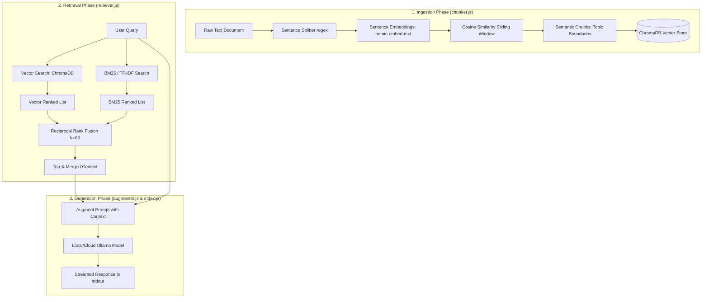
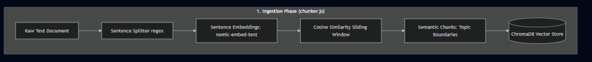
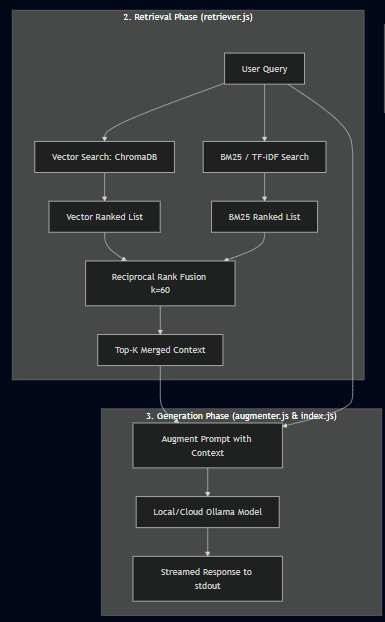

# Core RAG Concepts: Chunking, Keyword Search (TF-IDF/BM25), Cosine Similarity & Reciprocal Rank Fusion (RRF)

This document provides an in-depth breakdown of the foundational RAG algorithms implemented in [`chunker.js`] and [`retriever.js`]. It covers the underlying mathematical principles, step-by-step code walkthroughs, architectural diagrams, and curated resources for deeper study.

---

## Table of Contents
1. [Cosine Similarity (`cosineSimilarity`)](#1-cosine-similarity)
2. [Semantic Chunking (`semanticChunk`)](#2-semantic-chunking)
3. [Keyword-Based Search & TF-IDF / BM25 (`bm25Search`)](#3-keyword-based-search--tf-idf--bm25)
4. [Reciprocal Rank Fusion (`reciprocalRankFusion`)](#4-reciprocal-rank-fusion-rrf)
5. [End-to-End Hybrid RAG Workflow Architecture](#5-end-to-end-hybrid-rag-workflow-architecture)
6. [Further Reading & Resources](#6-further-reading--resources)

---

## 1. Cosine Similarity

### Conceptual Overview: Measuring Vector Orientation
In dense embedding spaces, text passages and queries are represented as high-dimensional vectors (e.g., arrays of 768 or 1536 floating-point numbers). 

**Cosine Similarity** measures the **cosine of the angle ($\theta$)** between two non-zero vectors in multi-dimensional space. Rather than measuring the straight-line distance between vector tips (Euclidean distance), cosine similarity evaluates whether two vectors point in the same conceptual direction, regardless of their magnitude (length).

```
        Vector A (Query)
          ^
          |  . 
          |   \   Angle θ  -> cos(θ) = 1.0 (Identical direction)
          |    .              cos(θ) = 0.0 (Orthogonal / Unrelated)
          +-------> Vector B (Document)
```

---

### Mathematical Formula

$$\text{Cosine Similarity}(\mathbf{a}, \mathbf{b}) = \frac{\mathbf{a} \cdot \mathbf{b}}{\|\mathbf{a}\| \|\mathbf{b}\|} = \frac{\sum_{i=1}^{n} a_i b_i}{\sqrt{\sum_{i=1}^{n} a_i^2} \sqrt{\sum_{i=1}^{n} b_i^2}}$$

Where:
- $\mathbf{a} \cdot \mathbf{b} = \sum_{i=1}^n a_i b_i$ is the **Dot Product** (sum of element-wise multiplications).
- $\|\mathbf{a}\| = \sqrt{\sum_{i=1}^n a_i^2}$ is the **L2 Norm (Euclidean Magnitude)** of vector $\mathbf{a}$.
- $\|\mathbf{b}\| = \sqrt{\sum_{i=1}^n b_i^2}$ is the **L2 Norm (Euclidean Magnitude)** of vector $\mathbf{b}$.

#### Interpretation of Values:
- **`+1.0`**: Vectors point in the exact same direction (highest semantic similarity / identical meaning).
- **`0.0`**: Vectors are orthogonal (completely unrelated / independent concepts).
- **`-1.0`**: Vectors point in diametrically opposite directions.

---

### Function Deep Dive: `cosineSimilarity` in [`chunker.js`]

```javascript
function cosineSimilarity(a, b) {
    const dot = a.reduce((sum, v, i) => sum + v * b[i], 0);
    const magA = Math.sqrt(a.reduce((sum, v) => sum + v * v, 0));
    const magB = Math.sqrt(b.reduce((sum, v) => sum + v * v, 0));
    return dot / (magA * magB);
}
```

#### Step-by-Step Execution:
1. **`dot`**: Multiplies corresponding elements $a_i \times b_i$ across all dimensions and accumulates their sum using `Array.prototype.reduce()`.
2. **`magA` & `magB`**: Computes the square of each element ($v^2$), sums them up, and takes the square root (`Math.sqrt`) to get the vector magnitudes $\|\mathbf{a}\|$ and $\|\mathbf{b}\|$.
3. **`dot / (magA * magB)`**: Normalizes the dot product by the product of both magnitudes to return the final cosine similarity score between $-1$ and $1$.

---

## 2. Semantic Chunking

### Conceptual Overview: Beyond Fixed-Size Chunking
Traditional chunking methods divide text based on arbitrary metrics:
- **Fixed Character Count** (e.g., 500 characters): Cuts words or thoughts mid-sentence.
- **Fixed Token Count with Overlap** (e.g., 256 tokens with 50-token overlap): Preserves words, but frequently splits a cohesive idea or merges two unrelated topics across boundaries.

**Semantic Chunking** uses embedding models to dynamically detect **topic shifts** and create natural, self-contained semantic boundaries.

```
Sentence 1: "Transformers use self-attention mechanisms."  \
                                                        --> Similarity = 0.88 (Keep in Chunk 1)
Sentence 2: "They process input tokens in parallel."        /
                                                        --> Similarity = 0.42 (Split! Threshold = 0.75)
Sentence 3: "ChromaDB is an open-source vector database."   \
                                                        --> Similarity = 0.82 (Keep in Chunk 2)
Sentence 4: "It allows fast nearest neighbor searches."     /
```

---

### How Semantic Chunking Works:
1. **Sentence Boundary Splitting**: Split raw document into individual sentences using punctuation boundaries.
2. **Dense Sentence Embeddings**: Generate an embedding vector for each individual sentence.
3. **Consecutive Similarity Comparison**: Compute cosine similarity between adjacent sentences ($\text{Sentence}_{i-1}$ vs $\text{Sentence}_i$).
4. **Breakpoint Detection**: If similarity drops below a predefined `threshold` (e.g. `0.75`), a topic transition has occurred $\rightarrow$ complete the current chunk and start a new one.

---

### Function Deep Dive: `semanticChunk` in [`chunker.js`]

```javascript
export async function semanticChunk(text, threshold = 0.75) {
    const sentences = text.split(/(?<=[.!?])\s+/);
    const embeddings = await Promise.all(sentences.map(embed));
    const chunks = [];
    let currentChunk = [sentences[0]];

    for (let i = 1; i < sentences.length; i++) {
        const sim = cosineSimilarity(embeddings[i - 1], embeddings[i]);
        if (sim < threshold) {
            chunks.push(currentChunk.join(' '));
            currentChunk = [];
        }
        currentChunk.push(sentences[i]);
    }
    if (currentChunk.length) chunks.push(currentChunk.join(' '));
    return chunks;
}
```

#### Step-by-Step Execution:
1. **`text.split(/(?<=[.!?])\s+/)`**: Uses a regex positive lookbehind `(?<=[.!?])` to split text at whitespace following sentence-ending punctuation (`.`, `!`, `?`), retaining the punctuation marks.
2. **`Promise.all(sentences.map(embed))`**: Asynchronously calls the embedding model on every sentence in parallel, returning an array of embedding vectors.
3. **`currentChunk = [sentences[0]]`**: Initializes the first chunk buffer with sentence 0.
4. **Sliding Window Loop (`for i = 1 ...`)**:
   - Calculates `sim = cosineSimilarity(embeddings[i - 1], embeddings[i])`.
   - **If `sim < threshold`**: The semantic meaning diverged. Joins `currentChunk` with spaces, pushes it to `chunks`, and resets the buffer.
   - Pushes `sentences[i]` to `currentChunk`.
5. **Tail Flush**: If `currentChunk` still holds sentences after the loop finishes, joins and pushes the final chunk.

---

## 3. Keyword-Based Search & TF-IDF / BM25

### Conceptual Overview: Why Lexical Search?
In modern RAG pipelines, **Vector Search** (dense retrieval) excels at semantic understanding (e.g., matching *"feline medical issues"* to *"sick cats"*). 

However, vector search often struggles with:
- **Exact keywords and acronyms** (e.g., product SKUs, error codes like `ERR_404_NOT_FOUND`, specific library names like `dotenvx`).
- **Rare words and named entities** (e.g., specific people, APIs, rare technical terms).
- **Short queries with precise terminology**.

**Lexical / Keyword Search** (sparse retrieval) bridges this gap by scoring documents based on the exact frequency and specificity of query terms.

---

### Key Concepts & Mathematical Intuition

#### 1. Term Frequency (TF)
Measures how frequently a term $t$ appears in document $d$:
$$\text{TF}(t, d) = \frac{\text{count}(t \text{ in } d)}{\text{total words in } d}$$

#### 2. Inverse Document Frequency (IDF)
Measures how rare or informative a term is across the entire collection of documents $D$:
$$\text{IDF}(t, D) = \log\left(\frac{|D|}{|\{d \in D : t \in d\}|}\right)$$

#### 3. TF-IDF Score
$$\text{TF-IDF}(t, d, D) = \text{TF}(t, d) \times \text{IDF}(t, D)$$
The overall score of document $d$ for query $Q$ is the sum of TF-IDF scores for all query terms present in the document.

#### 4. TF-IDF vs. BM25 (Best Matching 25)
BM25 is a non-linear evolution of TF-IDF that addresses two key limitations:
1. **Term Frequency Saturation**: Uses an asymptotic curve (parameter $k_1$) so additional term occurrences provide diminishing returns rather than linear growth.
2. **Document Length Normalization**: Penalizes excessively long documents (parameter $b$) to avoid favoring long texts over concise, relevant ones.

---

### Function Deep Dive: `bm25Search` in [`retriever.js`]
```javascript
// --- BM25-style keyword search using TF-IDF from the `natural` package ---
function bm25Search(query, documents, k = 10) {
    const tfidf = new TfIdf();
    documents.forEach(doc => tfidf.addDocument(doc));

    const scores = [];
    tfidf.tfidfs(query, (i, measure) => {
        scores.push({ index: i, score: measure, document: documents[i] });
    });

    return scores
        .sort((a, b) => b.score - a.score)
        .slice(0, k);
}
```

#### Step-by-Step Execution:
1. **`new TfIdf()`**: Instantiates a new TF-IDF engine from the [`natural`](https://github.com/NaturalNode/natural) NLP package.
2. **`documents.forEach(doc => tfidf.addDocument(doc))`**: Tokenizes and adds each document to build collection-level vocabulary and compute document statistics (IDF calculations).
3. **`tfidf.tfidfs(query, callback)`**: Evaluates the input `query` against all indexed documents. For each document at index `i`, it calculates the cumulative relevance score (`measure`).
4. **`scores.sort(...)`**: Sorts candidate documents in descending order of their relevance score ($b.score - a.score$).
5. **`.slice(0, k)`**: Returns the top-$k$ highest-scoring documents.

---

## 4. Reciprocal Rank Fusion (RRF)

### Conceptual Overview: The Challenge of Hybrid Search
When combining **Vector Search** (dense) and **Keyword Search** (sparse), a fundamental problem arises: **Score Incomparability**.

| Search Type | Score Range | Distribution Characteristics |
|---|---|---|
| Vector (Cosine Similarity) | $[0.0, 1.0]$ or $[-1.0, 1.0]$ | Tightly clustered (e.g., 0.72 - 0.88) |
| BM25 / TF-IDF | $[0, \infty)$ | Unbounded, non-linear (e.g., 0.0 to 18.5) |

Because raw scores from different algorithms cannot be directly summed or averaged without arbitrary calibration, **Reciprocal Rank Fusion (RRF)** combines them using **rank positions** instead of raw scores.

---

### Mathematical Formulation
For a document $d \in D$ and a set of retrieval rankings $M$:

$$\text{RRF\_Score}(d \in D) = \sum_{m \in M} \frac{1}{k + r_m(d)}$$

Where:
- $M$: The set of ranking systems (e.g., $M = \{\text{Vector Search}, \text{BM25}\}$).
- $r_m(d)$: The 1-based rank position of document $d$ in ranking system $m$ (1st place $= 1$, 2nd place $= 2$, etc.).
- $k$: A smoothing constant (typically $k = 60$).

#### Why is $k = 60$ used?
- Prevents top-ranked items in any single system from completely dominating the combined score.
- For example, with $k = 60$:
  - Rank 1: $\frac{1}{60 + 1} = 0.01639$
  - Rank 2: $\frac{1}{60 + 2} = 0.01612$
  - Rank 10: $\frac{1}{60 + 10} = 0.01428$
- Documents that appear consistently near the top across **multiple** retrieval channels accumulate higher scores than a document ranked #1 by only one system and missing from the other.

---

### Function Deep Dive: `reciprocalRankFusion` in [`retriever.js`]

```javascript
// --- Reciprocal Rank Fusion: merges two ranked lists into one ---
function reciprocalRankFusion(vectorDocs, bm25Results, k = 60) {
    const scores = new Map();

    // 1. Score vector search results by rank position
    vectorDocs.forEach((doc, rank) => {
        scores.set(doc, (scores.get(doc) || 0) + 1 / (k + rank + 1));
    });

    // 2. Score BM25 results by rank position
    bm25Results.forEach((item, rank) => {
        const doc = item.document;
        scores.set(doc, (scores.get(doc) || 0) + 1 / (k + rank + 1));
    });

    // 3. Sort by aggregated score descending and format output
    return [...scores.entries()]
        .sort(([, a], [, b]) => b - a)
        .map(([document, score]) => ({ document, score }));
}
```

#### Step-by-Step Execution:
1. **`const scores = new Map()`**: Tracks document strings and their accumulated RRF scores.
2. **Vector Scoring Loop**:
   - Iterates through `vectorDocs` (ordered 0 to $N-1$).
   - Rank is 0-indexed, so $r = \text{rank} + 1$.
   - Adds $\frac{1}{k + \text{rank} + 1}$ to each document's score.
3. **BM25 Scoring Loop**:
   - Iterates through ranked `bm25Results`.
   - Extracts `doc = item.document`.
   - Adds $\frac{1}{k + \text{rank} + 1}$ to the existing score in the map.
4. **Aggregation & Sorting**:
   - Converts `scores.entries()` into an array of `[document, score]` pairs.
   - Sorts descending by RRF score ($b - a$).
   - Returns structured objects `{ document, score }`.

---

## 5. End-to-End Hybrid RAG Workflow Architecture



### Visual Architecture Flowcharts

#### Phase 1: Ingestion & Semantic Chunking


#### Phase 2 & 3: Hybrid Retrieval, Reciprocal Rank Fusion & Generation


---

## 6. Further Reading & Resources

### Academic Papers & Foundational Research
- **Semantic Chunking & Text Tiling**:
  - *Hearst, M. A. (1997).* [TextTiling: Segmenting Text into Multi-paragraph Subtopic Passages](https://aclanthology.org/J97-1003.pdf).
- **Reciprocal Rank Fusion**:
  - *Cormack, G. V., Clarke, C. L., & Büttcher, S. (2009).* [Reciprocal Rank Fusion Outperforms Condorcet and Individual Rank Learning Methods (SIGIR '09)](https://dl.acm.org/doi/10.1145/1571941.1572114).
- **BM25 & Probabilistic Relevance Framework**:
  - *Robertson, S., & Zaragoza, H. (2009).* [The Probabilistic Relevance Framework: BM25 and Beyond](https://www.nowpublishers.com/article/Details/INR-019).

### Industry Guides & Implementations
- **Pinecone**: [Chunking Strategies for LLM Applications (Semantic Chunking)](https://www.pinecone.io/learn/chunking-strategies/)
- **Pinecone**: [Hybrid Search & Reciprocal Rank Fusion Explained](https://www.pinecone.io/learn/hybrid-search-rrf/)
- **Elasticsearch**: [Reciprocal Rank Fusion (RRF) in Elasticsearch Hybrid Search](https://www.elastic.co/guide/en/elasticsearch/reference/current/rrf.html)
- **Weaviate**: [Hybrid Search Explained (Dense + Sparse Fusion)](https://weaviate.io/blog/hybrid-search-explained)
- **Natural NPM Package**: [Natural: General Natural Language Utilities for Node.js](https://github.com/NaturalNode/natural)
